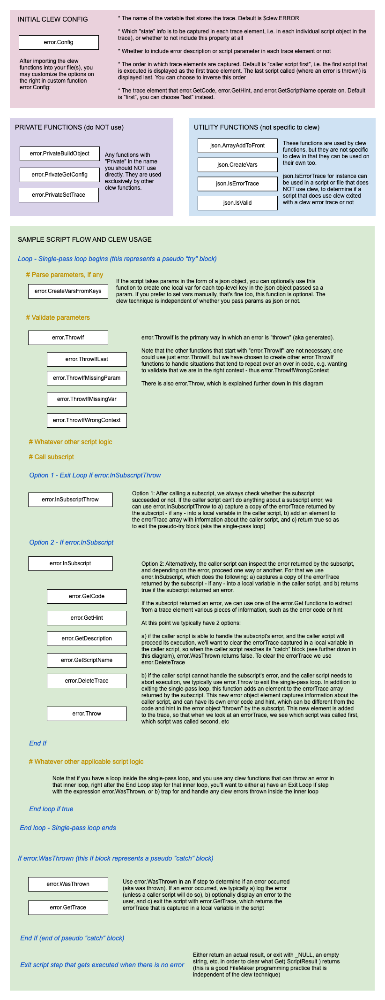

# Clew in a nutshell

Clew is a technique that allows FileMaker developers to easily implement validations and robust error trapping and handling in their solutions. Additionally, clew automatically captures a trace of script calls and errors, and state information for each script in the script call stack. This can represent most valuable information for debugging and logging purposes.

It's comprised of a suite of custom functions that have no dependencies on anything but themselves. Clew does not require any frameworks, it does NOT care about how you pass parameters or return results in scripts, and it does not require any schema, scripts, or layouts. When an error occurs in a script, it instantiates one and only one local variable (no cleanup of global vars is necessary after running scripts), which you can name whatever you want in the error.Config function.

 

# Getting started with clew

### To start using clew simply:

- Download the clew FileMaker file from the [latest release](https://github.com/soliantconsulting/clew/releases)
  - Copy and paste the "clew" custom functions folder into your solution and start using them

### Here are some references to learn how to use clew:

- Review the Demo and Template scripts in the FileMaker file, which showcase how to use clew
- Review the documentation below in this read me file
- Watch the [presentation](https://youtu.be/d4N7d0Kdxqs?si=o2sMZicN_oNEzbwz) I gave on clew at EngageU 2024

 

# Clew functions and anatomy of a FileMaker script that uses clew

The diagram below depicts all of the clew custom functions (except for constant error functions), and shows where and how they are used in a typical script

 

# Sample error trace generated by clew

Below is a very simple trace generated by clew. It represents a script sequence in which script "Demo script - Terse" called subscript "throws FMP error - Send Mail", and the subscript returned an error, which the caller script did not handle.

    {
      "directionOfTrace": "caller_script_last",
      "errorTrace": [
        {
          "code": 1502,
          "description": "Connection refused by SMTP server",
          "hint": "Failed to send notification for monthly reconciliation report",
          "script": {
            "name": "throws FMP error - Send Mail",
            "parameter": null,
            "stepNumber": 7,
            "stepType": "Send Mail"
          },
          "state": {
            "accountName": "Admin",
            "applicationVersion": "Pro 21.1.1",
            "layoutName": "AnotherTable Layout",
            "recordOpenCount": 1
          }
        },
        {
          "code": "UNEXPECTED",
          "description": "Generic, default error",
          "hint": "Unexpected error when calling this subscript: 'throws FMP error - Send Mail'",
          "script": {
            "name": "Demo script - Terse",
            "parameter": {
              "param_one": 15,
              "param_two": "I am a string"
            }
          },
          "state": {
            "accountName": "Admin",
            "applicationVersion": "Pro 21.1.1",
            "layoutName": "DemoTable Layout",
            "recordOpenCount": 0
          }
        }
      ]
    }

 

# Error trace schema

The pseudo-json structure below describes the json schema that a clew error trace adheres to:

$\color{#3399CC}{\textsf{blue}}$ properties make up the core json schema

$\color{#009966}{\textsf{green}}$ properties are optional or customizable to any one solution in which the clew technique is used

$\color{orange}{\textsf{orange}}$ properties are only included for FileMaker native errors, as they are parsed out of FileMaker function Get( LastErrorLocation )

{  
&nbsp;&nbsp; $\color{#3399CC}{\textsf{"directionOfTrace"}}$: // e.g. "caller_script_first"  
&nbsp;&nbsp; $\color{#3399CC}{\textsf{"errorTrace"}}$: [ // an array, i.e. trace, of objects with the below structure  
&nbsp;&nbsp;&nbsp;&nbsp; {  
&nbsp;&nbsp;&nbsp;&nbsp;&nbsp;&nbsp; $\color{#3399CC}{\textsf{"code"}}$: // number or string representing an error condition  
&nbsp;&nbsp;&nbsp;&nbsp;&nbsp;&nbsp; $\color{#009966}{\textsf{"description"}}$: // an English description of the "code" json property above  
&nbsp;&nbsp;&nbsp;&nbsp;&nbsp;&nbsp; $\color{#3399CC}{\textsf{"hint"}}$: // either a string or a json structure with customized info about the error  
&nbsp;&nbsp;&nbsp;&nbsp;&nbsp;&nbsp; $\color{#3399CC}{\textsf{"script"}}$: { // object that contains at least a "name" property  
&nbsp;&nbsp;&nbsp;&nbsp;&nbsp;&nbsp;&nbsp;&nbsp; $\color{#3399CC}{\textsf{"name"}}$: // name of script, as returned by FileMaker function Get( ScriptName )  
&nbsp;&nbsp;&nbsp;&nbsp;&nbsp;&nbsp;&nbsp;&nbsp; $\color{#009966}{\textsf{"parameter}}$: {} // string or json, as returned by Get( ScriptParameter )  
&nbsp;&nbsp;&nbsp;&nbsp;&nbsp;&nbsp;&nbsp;&nbsp; $\color{orange}{\textsf{"stepErrorDetail"}}$: // whatever FileMaker function Get( LastErrorDetail ) returns  
&nbsp;&nbsp;&nbsp;&nbsp;&nbsp;&nbsp;&nbsp;&nbsp; $\color{orange}{\textsf{"stepNumber"}}$: // e.g. 89, as returned by Get( LastErrorLocation )  
&nbsp;&nbsp;&nbsp;&nbsp;&nbsp;&nbsp;&nbsp;&nbsp; $\color{orange}{\textsf{"stepType"}}$: // e.g. Send Mail, as returned by Get( LastErrorLocation )  
&nbsp;&nbsp;&nbsp;&nbsp;&nbsp;&nbsp; },  
&nbsp;&nbsp;&nbsp;&nbsp;&nbsp;&nbsp; $\color{#009966}{\textsf{"state"}}$: { // optional object, 100% developer customizable  
&nbsp;&nbsp;&nbsp;&nbsp;&nbsp;&nbsp;&nbsp;&nbsp; $\color{#009966}{\textsf{"accountName"}}$: "Admin",  
&nbsp;&nbsp;&nbsp;&nbsp;&nbsp;&nbsp;&nbsp;&nbsp; $\color{#009966}{\textsf{"fileName"}}$: "FM_Error_Stack_Trace",  
&nbsp;&nbsp;&nbsp;&nbsp;&nbsp;&nbsp;&nbsp;&nbsp; $\color{#009966}{\textsf{"layoutName"}}$: "Table 1",  
&nbsp;&nbsp;&nbsp;&nbsp;&nbsp;&nbsp;&nbsp;&nbsp; $\color{#009966}{\textsf{"recordOpenCount"}}$: 0  
&nbsp;&nbsp;&nbsp;&nbsp;&nbsp;&nbsp; }  
&nbsp;&nbsp;&nbsp;&nbsp; }  
&nbsp;&nbsp; ]  
}  

Note: properties are partly named the way they are named, to ensure properties are displayed in the desired order, even when the json structure is sorted alphabetically by a json parser or editor

 

# Acknowledgements

Marcelo Piñeyro, the main developer of the clew technique, wishes to acknowledge the following people for their contributions to clew:

- Andrew "Kaz" McLamore, for sharing with us his implementation of capturing errors in FileMaker as json objects, and using the single-pass loop technique as a pseudo "try" block
- Ken Worthley, for his insights into the original implementation of clew, and for writing the function that is now called error.InSubscriptRethrow
- Anders Monsen, for coming up with the name "clew", and being one of the early adopters of the technique
- My various other Soliant colleagues, whom provided valuable insights and feedback which helped clew be what it is today
